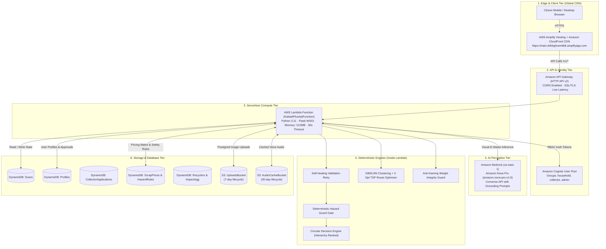

# KabadiPlus v2 ♻️

> **AI-Assisted Circular Economy Decision & Pooled Collection Platform for E-Waste**  
> **AWS Environmental Hacks Hackathon** · Waste & Energy Track  
> **Live Production App (AWS Amplify)**: [https://main.dr84g0oee4lb8.amplifyapp.com](https://main.dr84g0oee4lb8.amplifyapp.com)  
> **Live Serverless API (API Gateway + Lambda)**: `https://s8rzucf885.execute-api.us-east-1.amazonaws.com`  
> **AI Foundation Perception**: Amazon Bedrock (`amazon.nova-pro-v1:0`)  
> **GitHub Repository**: [https://github.com/ajayg10/scrapmitra.git](https://github.com/ajayg10/scrapmitra.git)

---

## 1. Product Mission & Problem Statement

India generates over **3.2 million tonnes of electronic waste annually**, with **85–90% handled by the informal recycling sector (*kabadiwalas*)**:
1. **Uninformed Citizen Disposal**: Households have no reliable way to assess whether an old device is repairable, resellable, or hazardous. Most e-waste ends up in mixed municipal trash or informal backyard burning.
2. **Severe Occupational Hazards**: Informal pickers dismantle unfamiliar devices without knowing about swelling lithium-ion batteries, toxic lead glass in CRT tubes, mercury vapor in CCFL screens, or carcinogenic dioxins from open PCB smelting.
3. **Inefficient, High-Emission Collection**: Individual, uncoordinated collection trips burn excessive vehicle transit fuel, making low-density e-waste collection uneconomic.
4. **"Greenwashing" & Fraudulent Impact**: Conventional apps credit rewards on mere photo uploads without verifying if the hardware ever reached an authorized circular handler.

### The Product Thesis
> *"We do not help people throw e-waste away better. We help them avoid throwing it away in the first place."*

KabadiPlus deterministically enforces the circular hierarchy:
$$\text{Reuse (Secondary Market)} > \text{Repair-then-Reuse} > \text{Authorized Recycling} > \text{Safe Hazardous Disposal}$$

---

## 2. The Core Engineering Rule

> **"The Multimodal LLM perceives and describes. Deterministic code and audited data tables decide value, occupational hazards, ranking, spatial clustering, routing, and reward points."**

- **Why this matters**: A naive LLM wrapper hallucinating device prices or safety rules is dangerous. In KabadiPlus v2:
  - **Amazon Bedrock (Nova Pro)** extracts structured hardware traits from messy real-world photos.
  - **Deterministic Circular Decision Engine** calculates real INR secondary valuations and avoided embodied carbon based on vetted hardware priors (`device_catalog.json`).
  - **Deterministic Hazard Guard** acts as an unbreakable safety circuit: swollen batteries or burnt devices are locked out of informal reuse or open dismantling.
  - **DBSCAN Clustering + 2-Opt TSP Router** batches doorstep pickups into optimized loops, measuring exact kilometres saved and fuel emissions avoided.
  - **Single-Use QR Handover Ledger** requires mutual two-party physical sign-off and scale weight checks before any impact points are credited.

---

## 3. End-to-End System Architecture



---

## 4. Comprehensive Feature Guide

### 📱 1. AI Multimodal Perception & Device Inspection
* **Live Amazon Bedrock Nova Pro (`amazon.nova-pro-v1:0`)**:
  * Perceives electronics in real-world environments via the Bedrock Converse API with grounding prompts in [`backend/prompts/vision_system.md`](file:///d:/Projects/Scrapmitra/kabadiplus/backend/prompts/vision_system.md).
  * Classifies device type across 25 canonical categories, predicts brand, age band, condition, internal parts, and visible damage.
* **Flexible Image Capture**:
  * Direct smartphone camera access (`capture="environment"` for mobile cameras).
  * Local file / gallery upload with drag-and-drop.
  * Live in-browser webcam streaming with one-click snapshot capture.
  * Instant testing presets: **📱 Smartphone**, **💻 Laptop**, and **📺 CRT TV**.
* **Client-Side Privacy & Compression**:
  * Canvas compression reduces images to $<300\text{ KB}$ before upload.
  * Client-side EXIF stripping removes GPS coordinates and personal device metadata.
* **Pre-Inference Power Question**:
  * Captures *"Does it turn on?"* (Yes / No / Unsure) to calibrate secondary market reuse pricing vs scrap recovery.
* **Low-Confidence Angle Guidance**:
  * If confidence is $<0.6$, the system gracefully instructs the user to take another photo from a specific angle (e.g., *"Capture the rear label showing model number"*).

### ⚖️ 2. Deterministic Circular Decision Engine
* **Strict Circular Hierarchy**:
  * Ranks options deterministically: **Reuse > Repair-then-Reuse > Authorized Recycling > Safe Hazardous Disposal**.
* **Fair Market Valuation (INR)**:
  * Computes secondary market values based on canonical device priors, age band depreciation, and damage penalties. No LLM price hallucinations.
* **Embodied Carbon ($\text{CO}_2\text{e}$) Avoided**:
  * Calculates avoided mineral extraction and manufacturing footprint using vetted LCA GHG emission factors (`emission_factors.json`).
* **Side-by-Side Trade-off Table**:
  * Transparently compares each option's financial return, environmental impact, and turnaround time against throwing it in the dustbin.
* **Bilingual Speech Synthesis**:
  * Text-to-speech audio narration in English (`en-IN`) and Hindi (`hi-IN`) for low-literacy users.

### 🛡️ 3. Non-Collapsible Hazard Guard
* **Occupational Risk Gatekeeper**:
  * Automatically detects high-risk e-waste materials:
    * **Swollen Li-Ion Batteries** (`HAZ_LI_ION` — thermal runaway & fire).
    * **CRT TV Glass / Heavy Lead** (`HAZ_CRT_LEAD` — implosion & neurotoxic lead).
    * **Fluorescent Backlight Tubes** (`HAZ_MERCURY` — neurotoxic mercury vapor).
    * **Burnt Circuit Boards** (`HAZ_PCB_BURN_FUMES` — carcinogenic dioxin inhalation).
* **Safety Overrides Economics**:
  * Hazardous devices are strictly locked out of informal reuse or open dismantling and routed exclusively to certified hazardous waste handlers.
  * High-visibility **DO** and **DON'T** safety guidelines are prominently displayed.

### 📦 4. Single-Use QR & Two-Party Verified Handover
* **Single-Use Pickup Token**:
  * Generates cryptographic single-use QR tokens (`qr_<req_id>_<item>`) tied to the household pickup request.
* **3-Stage Lifecycle Stepper**:
  * Visual progress tracker: `Requested` $\rightarrow$ `Clustered` $\rightarrow$ `Verified`.
* **Two-Party Physical Sign-off**:
  * Points and diversion credits are unlocked **strictly upon two-party verification**: the collector inputs the physical weight, and the citizen confirms the handover.

### 🚚 5. Spatial Clustering & 2-Opt TSP Route Optimizer
* **DBSCAN Density Clustering**:
  * Groups dispersed pickup requests into dense geographic neighborhood clusters (e.g., Nehru Place, Okhla, Kalkaji).
* **2-Opt Traveling Salesperson (TSP) Optimizer**:
  * Dynamically calculates the shortest multi-stop collection route between stops, depots, and recyclers.
* **Measured Kilometres Saved**:
  * Measures baseline unoptimized round trips vs the optimized circuit, displaying exact **transit km saved** and avoided vehicle fuel emissions.

### 🔒 6. Anti-Gaming & Weight Sanity Guards
* **Weight Bounds Verification**:
  * Compares collector-entered scale weights against canonical catalog weight priors.
* **Variance Flagging**:
  * Flags transactions exceeding $2.5\times$ expected item weight as potential fraud.
* **Self-Handover Prevention**:
  * Collectors cannot verify pickup requests they created themselves.
* **Exclusion of Unverified Claims**:
  * Leaderboard rankings and carbon impact stats ignore unverified or self-reported claims.

### 👥 7. Multi-Role Authentication & Access Control (Amazon Cognito)
* **Guest-First Inspection**:
  * Anyone can scan and inspect devices immediately without being blocked by a login wall.
* **Scan Claiming Flow**:
  * When a guest books a pickup, they sign in or create an account, and their scan is automatically transferred to their account profile.
* **Household Portal**:
  * Self-service sign-up and login with email and password.
* **Regulated Collector Portal**:
  * Informal collectors submit an onboarding application with vehicle type and license details.
  * Accounts are held in pending status until approved by a municipal administrator.
* **Municipal Admin Dashboard**:
  * Municipal officers can review collector applications and grant **Hazardous Material Handling Authorization**.
  * Trigger live city-wide pickup aggregation runs on demand.
* **1-Click Persona Testing Switcher**:
  * Instant demo switcher buttons (`[Household]`, `[Collector]`, `[Admin]`) in the header for frictionless testing.

### 📊 8. Verified Impact Dashboard & Privacy Shield Leaderboard
* **Personal Impact**:
  * Tracks verified kilograms diverted, embodied carbon avoided, and earned Eco Points.
* **Pseudonymous Community Leaderboard**:
  * Ranks households and authorized collectors across municipal zones.
  * **Privacy Shield**: Displays privacy-preserving handles (e.g., `EcoCitizen-Kalkaji-01`) rather than exposing phone numbers or home addresses.

### 🌐 9. Full Bilingual Accessibility (English & Hindi)
* **Instant Language Toggle**:
  * Seamless one-click switching between English and हिंदी with 100% UI translation coverage.
* **Native Speech Synthesis**:
  * Web Speech API integration calibrated for Indian accents (`en-IN` and `hi-IN`).

---

## 5. AWS Cloud Services Utilized (11 Native Services)

| AWS Service | Resource / Model Name | Architectural Role in KabadiPlus |
| :--- | :--- | :--- |
| **Amazon Bedrock** | `amazon.nova-pro-v1:0` (`us-east-1`) | Multimodal foundation model vision perception via Converse API. |
| **AWS Amplify Hosting** | App ID: `dr84g0oee4lb8` | Continuous deployment and edge hosting for the PWA with custom SPA rewrite rules. |
| **Amazon CloudFront** | Amplify Edge CDN | Sub-50ms global content delivery and automated SSL/TLS termination. |
| **Amazon API Gateway** | HTTP API v2 (`s8rzucf885...`) | High-throughput REST API gateway routing all `/v1/*` endpoints with CORS. |
| **AWS Lambda** | `KabadiPlusApiFunction` (Python 3.11, 512MB) | Serverless execution of REST API, decision engine, clustering, and route optimizer. |
| **Amazon Cognito** | `KabadiPlusUserPool` (`us-east-1_SHl0o9DDs`) | Multi-role RBAC managing `household`, `collector`, and `admin` groups. |
| **Amazon DynamoDB** | 10 On-Demand Tables | Sub-10ms NoSQL state storage (`Scans`, `Profiles`, `ScrapPrices`, `HazardRules`, etc.). |
| **Amazon S3** | `UploadsBucket` & `AudioCacheBucket` | Encrypted object storage with automated 7-day and 30-day lifecycle expiration rules. |
| **AWS IAM** | `KabadiPlusApiFunctionRole` | Least-privilege IAM policies scoped to Bedrock, DynamoDB, S3, and Cognito. |
| **AWS SAM & CloudFormation**| Stack: `kabadiplus-v2` | Infrastructure as Code (IaC) defined in [`infra/template.yaml`](file:///d:/Projects/Scrapmitra/kabadiplus/infra/template.yaml). |
| **Amazon CloudWatch** | CloudWatch Logs & Metrics | Centralized logging, latency tracking, and error monitoring. |

---

## 6. Repository Structure

```text
kabadiplus/
├── amplify.yml                     # AWS Amplify continuous deployment build spec
├── frontend/                       # Progressive Web App (React 19 + TypeScript + Vite)
│   ├── .env.production             # Production environment variables (API Gateway endpoint)
│   ├── src/
│   │   ├── App.tsx                 # Main application shell with all 6 navigation tabs
│   │   ├── main.tsx                # App entrypoint with global API Gateway base routing
│   │   ├── i18n.ts                 # Bilingual configuration (English & Hindi)
│   │   ├── style.css               # Clean, accessible styling & animations
│   │   ├── components/             # Reusable UI components (Icon, etc.)
│   │   └── generated/              # Auto-generated taxonomy types and icons
│   ├── locales/                    # Translation dictionaries (en.json, hi.json)
│   └── tests/
│       └── shell.spec.ts           # Playwright end-to-end golden path browser test
├── backend/                        # Serverless Python backend
│   ├── requirements.txt            # Python dependencies for AWS Lambda packaging
│   ├── core/
│   │   ├── catalog.py              # Canonical hardware catalog reader
│   │   ├── decision_engine.py      # Deterministic circular hierarchy & valuation engine
│   │   ├── hazard_guard.py         # Non-collapsible occupational safety gate
│   │   ├── clustering.py           # DBSCAN spatial density clustering algorithm
│   │   ├── routing.py              # 2-Opt TSP route solver with km saved calculation
│   │   ├── anti_gaming.py          # Weight bounds & 2-party handover verification
│   │   ├── vision_client.py        # Amazon Bedrock Nova Pro multimodal client
│   │   └── models.py               # Pydantic v2 schemas and validation models
│   ├── functions/
│   │   └── app.py                  # Flask REST API server and AWS Lambda WSGI handler
│   ├── prompts/
│   │   └── vision_system.md        # Grounded vision system prompt with weight priors
│   └── tests/                      # 125 comprehensive pytest unit and integration tests
├── data/                           # Canonical domain data
│   ├── taxonomy.json               # 25 device categories, 21 parts, 10 hazards, 5 circular options
│   ├── decision_rules.json         # Valuation formulas, depreciation, and viability thresholds
│   ├── emission_factors.json       # Documented LCA GHG factors and transport emission rates
│   └── seed/                       # Catalogs, demo households, collectors, and recyclers
├── infra/                          # Infrastructure as Code
│   ├── template.yaml               # AWS SAM / CloudFormation serverless template
│   └── README.md                   # Infrastructure documentation
├── scripts/                        # Utility scripts
│   ├── deploy_amplify.py           # Automated AWS Amplify deployment script via boto3
│   ├── export_schemas.py           # JSON schema generator
│   └── generate_taxonomy.py        # Canonical taxonomy code generator
└── docs/                           # Architectural documentation
    ├── ARCHITECTURE.md             # System architecture & design choices
    ├── ASSUMPTIONS.md              # Carbon lifecycle & routing mathematics
    ├── DECISIONS.md                # Technical decisions & AWS model selections
    └── LIMITATIONS.md              # Transparent disclosure of demo data & production scope
```

---

## 7. Local Setup & Testing

### Prerequisites
- **Node.js**: $\ge 20$ (tested on Node 22 & 24)
- **Python**: $3.11$ or $3.12$
- **AWS CLI** & **AWS SAM CLI**: Installed and configured (`aws configure`)

### 1. Run All Tests
```bash
# Run backend pytest suite (125 tests)
python -m pytest backend/tests/ -q

# Run frontend typecheck
npm --prefix frontend run typecheck

# Run Playwright E2E browser tests (Desktop & Mobile shells)
npx --prefix frontend playwright test
```

### 2. Run Locally in Development
```bash
# Terminal 1: Start backend API server (runs on port 5001)
python backend/functions/app.py

# Terminal 2: Start frontend PWA dev server (runs on port 5173)
npm --prefix frontend run dev
```
Open `http://localhost:5173` in your browser.

---

## 8. Deployment Commands

### Deploy Backend Stack to AWS SAM
```bash
sam build -t infra/template.yaml
sam deploy --stack-name kabadiplus-v2 --region us-east-1 --resolve-s3 --capabilities CAPABILITY_IAM CAPABILITY_NAMED_IAM --no-confirm-changeset
```

### Deploy Frontend to AWS Amplify
```bash
npm --prefix frontend run build
python scripts/deploy_amplify.py
```

---

## 9. Automated Test Verification Summary

| Test Category | Suite / Command | Result |
| :--- | :--- | :---: |
| **Backend Test Suite** | `pytest backend/tests/` | **125 Passed** (100%) |
| **Frontend TypeScript Types** | `npm --prefix frontend run typecheck` | **0 Errors** |
| **Frontend Production Build** | `npm --prefix frontend run build` | **Built in ~650ms** |
| **Playwright E2E Tests** | `playwright test` (Desktop & Mobile Shells) | **2 Passed** (100%) |
| **AWS SAM Template Linter** | `sam validate --lint -t infra/template.yaml` | **Template Valid** |
| **Live Cloud API Health** | `curl https://s8rzucf885.execute-api.us-east-1.amazonaws.com/v1/health` | **200 OK (Healthy)** |
| **Live Amplify App** | `curl -I https://main.dr84g0oee4lb8.amplifyapp.com` | **200 OK (CloudFront)** |

---

## 10. License & Credits

Built for the **AWS Environmental Hacks Hackathon (Waste & Energy Track)**.  
Designed to bring dignity, safety, and verifiable circularity to India's informal recycling ecosystem.
