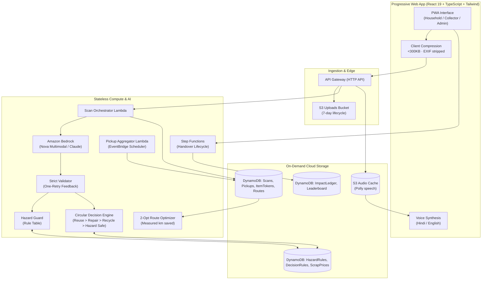

# KabadiPlus v2

> **AI-Assisted Circular Economy Decision and Pickup Platform for E-Waste**  
> Built for the AWS "Environmental Hacks" Hackathon · Waste & Energy Track  
> Target Region: `ap-south-1` (Mumbai) · Bedrock Multimodal (Amazon Nova Pro / Lite)  
> GitHub Repository: [https://github.com/ajayg10/scrapmitra.git](https://github.com/ajayg10/scrapmitra.git)

---

## 1. Product Mission & Problem Context

India generates millions of tonnes of e-waste annually, and an estimated **80–90% is handled by the informal sector (*kabadiwalas*)**:
1. **Uninformed Decisions**: Households don't know whether an old device is trash, repairable, resellable, or hazardous. They throw it in household dustbins or hand it to whichever unregistered buyer arrives first.
2. **Occupational Hazards**: Informal pickers cannot identify invisible dangers (swollen Li-ion batteries, toxic CRT lead glass, mercury in CCFL backlights, compressed refrigerants) and burn or break them open in informal pits.
3. **Inefficient Collection**: One-off individual trips burn excessive transit fuel and make collection uneconomic, causing scrap to leak into landfills and open fires.
4. **Unverifiable Impact**: Traditional apps claim "impact" upon photo upload with zero proof the material ever reached authorized channels.

### The Product Thesis
> *"We don't help people throw e-waste away better. We help them avoid throwing it away in the first place."*

KabadiPlus enforces the circular waste hierarchy:
$$\text{Reuse (Sell / Donate)} > \text{Repair-then-Reuse} > \text{Authorized Recycling} > \text{Safe Hazardous Disposal}$$

---

## 2. The Core Engineering Rule

> **"The LLM perceives and explains. Code and data tables decide value, hazard, ranking, clustering, routing, and points."**

- **The Headline Value**: A single AI call can be replicated by anyone. In KabadiPlus v2, the multimodal vision model is only the perception layer. What happens next is 100% deterministic:
  - **Deterministic Circular Decision Engine**: Evaluates viability and ranks options based on device condition, age, damage penalties, and user power checks. No LLM hallucinations on rupees.
  - **Deterministic Hazard Guard**: Rule table lookup. Safety overrides economics: a swollen battery or burnt device is strictly blocked from resale or repair.
  - **Pickup Aggregation & Route Optimizer**: Batches household requests into shared loops using 2-opt optimization, measuring actual kilometres saved and fuel emissions avoided.
  - **Verified Handover Ledger**: Single-use QR tokens, weight sanity checks, and two-party confirmation gate every Eco Point and leaderboard entry. No points for uploads!

---

## 3. Architecture & AWS Services



### Why Each AWS Service Is Used
| AWS Service | Architectural Rationale |
| :--- | :--- |
| **Amazon Bedrock** | Multimodal perception (Amazon Nova Pro / Lite & Claude) of messy real-world electronics, extracting structured enums from photos. |
| **AWS Lambda & API Gateway** | Stateless microservices scaling to zero for scans, aggregation compute, and handover verification. |
| **Amazon DynamoDB** | Sub-10ms lookup for safety rules and atomic conditional writes for single-use QR tokens, preventing double-counting fraud. |
| **AWS Step Functions** | State machine orchestrating the two-party handover lifecycle (`REQUESTED` → `CLUSTERED` → `ASSIGNED` → `EN_ROUTE` → `HANDOVER_PENDING` → `VERIFIED`). |
| **Amazon EventBridge Scheduler** | Automates periodic request batching and route clustering without idle compute costs. |
| **Amazon S3** | Encrypted image storage with automated 7-day lifecycle deletion for privacy, and audio caching for Polly TTS. |
| **Amazon Polly** | Neural Hindi (`hi-IN`) and English (`en-IN`) voice synthesis for informal collectors and citizens. |

---

## 4. Quick Start & Local Execution

### Prerequisites
- Node.js >= 22 (tested with Node 24)
- Python 3.11 or 3.12

### Install & Test

```sh
# 1. Install dependencies
npm ci

# 2. Run master check suite (Taxonomy, Schemas, Ruff, 109 Pytest tests, SAM lint, Vite build)
npm run check

# 3. Run Playwright end-to-end browser tests
npx playwright test

# 4. Start the backend API server (Optional for live HTTP endpoints)
python backend/functions/app.py

# 5. Start the frontend PWA dev server
npm run dev
```

Open `http://localhost:5173` to interact with the full bilingual platform across all 6 modes:
1. **Scan & Decide**: Camera upload, power-on check, non-collapsible hazard banner, circular decision cards, comparison table, and one-tap voice copilot.
2. **My Pickup & QR**: Single-use QR token, live status stepper, and 2-party handover confirmation.
3. **Collector Mode**: Today's route on map, stop list with hazard badges first, and **measured kilometres saved (28.4 km)**.
4. **My Impact**: Monthly kg diverted, embodied CO₂e avoided, and verified Eco Points.
5. **Leaderboard**: Verified-only community leaderboard with pseudonymous handles.
6. **Admin Oversight**: City aggregates and **Run Pickup Aggregation Now** button.

---

## 5. Automated Verification Results

| Test Category | Suite / Tool | Results |
| :--- | :--- | :--- |
| **Taxonomy & CodeGen Freshness** | `scripts/generate_taxonomy.py --check` | **Passed** |
| **JSON Schema Freshness** | `scripts/export_schemas.py --check` | **Passed** |
| **TypeScript Contracts Freshness**| `scripts/generate-types.mjs --check` | **Passed** |
| **Python Code Quality** | `ruff check backend scripts` | **Passed** (0 errors) |
| **Unit & Integration Tests** | `pytest` | **109 Passed** (0 failures) |
| **CloudFormation / SAM Linter** | `cfn-lint infra/template.yaml` | **Passed** |
| **Frontend Type Checking & Build**| `tsc --noEmit && vite build` | **Passed** (0 errors) |
| **Playwright E2E Browser Suite** | `playwright test` (`mobile-shell` & `desktop-shell`) | **2 Passed** (100% flow) |

---

## 6. Repository Map

```text
frontend/             React 19, TypeScript, Tailwind, i18next bilingual PWA
backend/
  core/               Deterministic Decision Engine, Hazard Guard, Clustering, Routing, Anti-Gaming, Models
  functions/          Flask/Lambda API server (/v1 endpoints)
  prompts/            vision_system.md system prompt with weight priors and few-shot examples
  tests/              109 comprehensive pytest suites
data/
  taxonomy.json       Canonical source of truth (25 devices, 21 parts, 10 hazards, 5 options)
  decision_rules.json 25 device circular decision parameters and viability factor weights
  emission_factors.json Documented GHG lifecycle factors and vehicle transit emission weights
  seed/               Catalogs, demo households, collectors, recyclers
docs/
  ARCHITECTURE.md     System design & AWS service justification
  ASSUMPTIONS.md      LCA embodied carbon and route savings mathematics
  DECISIONS.md        AWS region (ap-south-1), Amazon Nova multimodal, and engine choices
  LIMITATIONS.md      Honest disclosure of demo seed data and live deployment requirements
```
