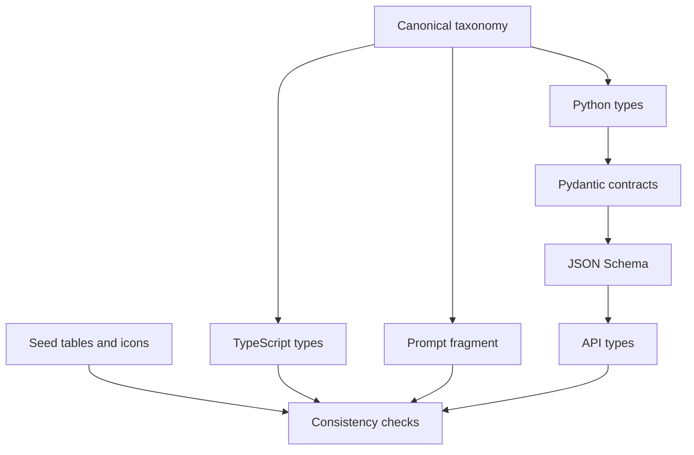
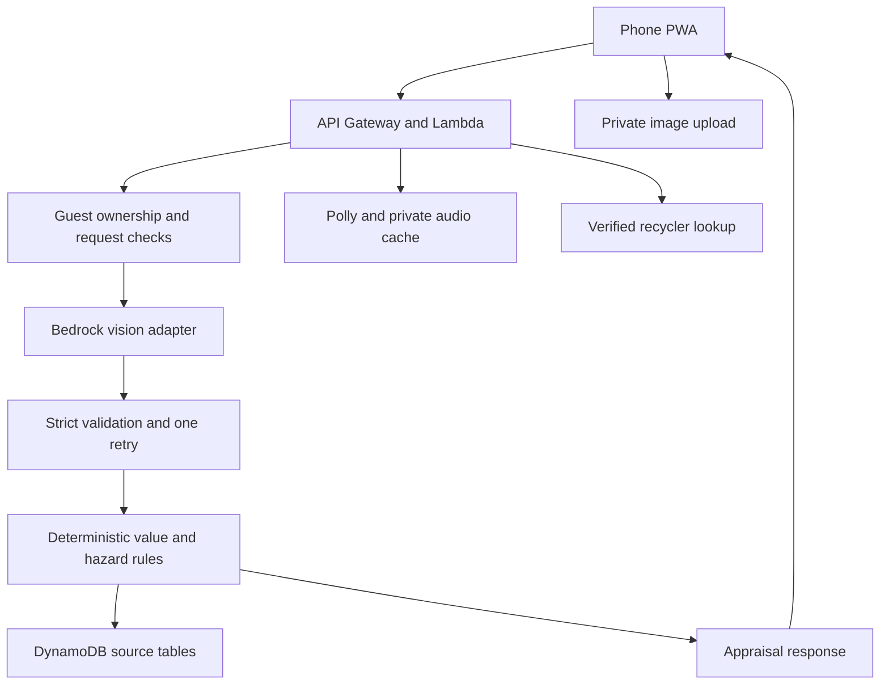

# Architecture

## Implemented foundation

`data/taxonomy.json` generates Python literals, TypeScript unions, and the allowed-enum prompt fragment. `data/icons.json` generates icon maps whose values must exist in the frontend registry. Pydantic models produce JSON Schema and TypeScript API contracts. CI rejects drift, malformed vision contracts, missing seed mappings, and incomplete translations.

Only the bilingual shell reads the device catalog at runtime. It does not call a backend. The SAM template defines storage, but nothing has been provisioned.

## Planned P0 runtime

The source tables, rather than model prose, control rates, grades, safety text, and routing. Hazard rules must merge device defaults, identified-part mappings, and explicit detections so a model omission cannot silently clear a known hazard. Low confidence must force a re-shoot. P1 agents may coordinate validated tools, but never bypass these requirements.

## Storage scaffold

| Resource | Key / role |
| --- | --- |
| ScrapPrices | `material_class` + `grade` |
| HazardRules | `hazard_id` |
| Recyclers | `recycler_id`; city index |
| DismantleGuides | `guide_id` |
| Scans | `owner_id` + `scan_id`; TTL |
| Corrections | `scan_id` + `correction_id`; TTL |
| ImpactAgg | `city_month` + `metric`; value of city_month will be `city#YYYY-MM` |
| OfferChecks | `scan_id` + `ts`; TTL |
| UploadsBucket | Private, encrypted, single-origin PUT CORS, seven-day lifecycle |
| AudioCacheBucket | Private, encrypted, thirty-day cache expiration |

No IAM execution roles, public routes, authorizers, model IDs, Cognito resources, or Cedar enforcement exist in Phase 1. Their interfaces and denial requirements must be implemented before claiming role isolation. DynamoDB point-in-time recovery in this scaffold adds storage cost and may retain scan records in backups beyond row TTL; the eventual privacy policy must address backups explicitly.
