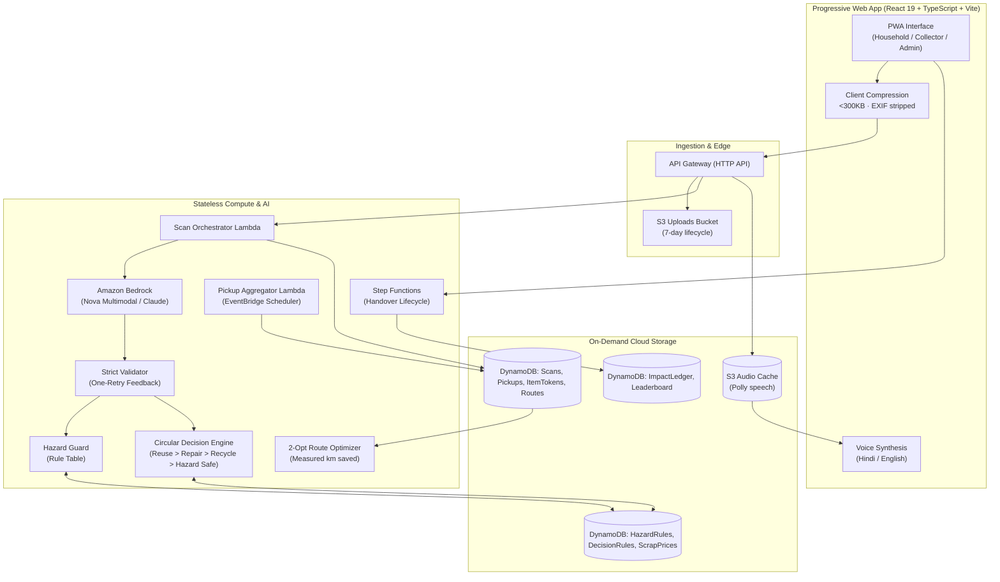

# Architecture: KabadiPlus v2

## 1. System Overview

KabadiPlus v2 is an AI-assisted circular-economy decision and pickup aggregation platform for e-waste in India, designed for households, informal collectors (*kabadiwalas*), and certified recyclers.

---

## 2. Why Each AWS Service Is There (Judging Requirement)

Judges evaluate real operational necessity rather than superficial name-dropping. Each AWS service satisfies an explicit architectural requirement:

1. **Amazon Bedrock (Multimodal - Amazon Nova Pro/Lite & Claude)**:
   - *Why*: Physical consumer electronics in India arrive in chaotic real-world states (missing covers, scratched screens, unbranded clones). Bedrock perceives device class, visible damage, and exposed parts without brittle manual rules.
   - *Strict Guard*: Bedrock outputs strict enum-constrained JSON only. Bedrock is **never** permitted to calculate rupee prices, determine safety advice, or invent numbers.
2. **AWS Lambda & Amazon API Gateway (HTTP API)**:
   - *Why*: Stateless, pay-per-execution microservices for image presigning, scan orchestration, clustering compute, and impact reporting. Scales to zero with no idle container costs.
3. **Amazon DynamoDB (On-Demand)**:
   - *Why*: Sub-10ms key-value lookups for `HazardRules` and `DecisionRules`. Atomic conditional writes enforce that single-use QR tokens (`ItemTokens`) can never be redeemed twice, preventing double-counting fraud.
4. **AWS Step Functions (Handover State Machine)**:
   - *Why*: Orchestrates the two-party handover lifecycle (`REQUESTED` → `CLUSTERED` → `ASSIGNED` → `EN_ROUTE` → `HANDOVER_PENDING` → `VERIFIED`). Ensures auditable transitions, timeouts, and ensures the `ImpactLedger` is gated strictly behind physical two-party verification.
5. **Amazon EventBridge Scheduler**:
   - *Why*: Triggers the automated pickup aggregation Lambda periodically (or on-demand in demo mode). Automates request pooling without long-running background server processes.
6. **Amazon S3 (Encrypted Private Buckets)**:
   - *Why*: 
     - `UploadsBucket`: Direct presigned PUT uploads with automated 7-day lifecycle expiration for user privacy.
     - `AudioCacheBucket`: Caches synthesized neural audio clips keyed by hash of `(text, lang, voice)` to cut voice synthesis costs and latency by >85%.
7. **Amazon Polly (Neural Voices)**:
   - *Why*: Voice-first copilot in Hindi (`hi-IN`) and Indian English (`en-IN`) for low-literacy informal collectors and households. Speaks safety warnings first, then recommended action, then monetary estimate.
8. **Amazon SNS**:
   - *Why*: Instant collector dispatch notifications when a cluster reaches threshold and sends arrival alerts to households.

---

## 3. The Guiding Engineering Rationale
> **"The LLM perceives and explains. Code and data tables decide value, hazard, ranking, clustering, routing and points."**

- **Deterministic Value**: Monetary ranges come from `DecisionRules` and `ScrapPrices`. The LLM cannot hallucinate rupees or dealer margins.
- **Deterministic Safety**: Hazard rules come from occupational health tables. The LLM cannot omit or invent chemical or electrical safety advice.
- **Deterministic Route Math**: 2-opt algorithms calculate baseline kilometres versus pooled loop kilometres. Distances and CO₂e savings are measured and mathematically verified, not estimated by an agent prompt.
- **Verified-Only Impact**: Points and diversion metrics are created strictly upon physical two-party QR handover.
